# Day3 比赛全过程复现（深度版）

> 比赛：2026-10-01 CSP-S 复赛赛前模拟赛 Day3  
> 最终成绩：**204 / 400 = A100 + B65 + C24 + D15**  
> 证据来源：4:08 录音转写、32,890 个原始键盘事件 / 8,822 行可读键流、虚拟机最终源码与 notes、OJ 记录页、题面与 checker、附件样例。  
> 这份文档不再讨论“赛后正解是否已经验证”，而专门回答：**比赛当时到底发生了什么，你是怎样研究的，哪里开始偏，什么时候其实已经摸到正确东西，为什么最后没有变成分数。**

---

## 0. 先给整场定性：不是“不会做”，而是四种完全不同的比赛状态

这场不能简单总结为“B 卡太久”。

四题呈现出四种完全不同的状态：

| 题 | 赛时状态 | 本质 |
|---|---|---|
| A 报数 | **发现快，落地慢** | 算法约 6 分钟形成，之后 20 多分钟耗在 API / 容器 / 边界 |
| B 翻面消除 | **发现了多个正确不变量，但研究方法失控** | 正确事实、错误猜想、样例规律混在一起；没有用小空间穷举固定研究方向 |
| C 任务领取 | **时间严重不足，但已经摸到满分入口** | “一定有一个人拿不到任务”就是根模型入口，随后又问“会不会他是最大的” |
| D 同类分段 | **纯抢分状态，模型没有来得及抽象** | 还停留在“维护两个集合”的操作层，没有转成 first/last 的逻辑条件 |

所以真正要修的不是一个算法知识点，而是：

1. **如何把“发现”变成可锁定的不变量；**
2. **如何把猜想交给程序自动反驳，而不是继续手玩；**
3. **如何在单题陷入研究循环时切走；**
4. **如何区分“我没有时间继续推”和“我不会这个算法”。**

---

# 1. 整场时间轴

```mermaid
gantt
    title Day3 四小时比赛实际轨迹
    dateFormat  X
    axisFormat  %M

    section A 报数
    读题+手玩                 :a1, 5, 6
    贪心形成                 :a2, 11, 3
    实现/API/边界调试         :a3, 14, 21
    附件+提交                 :a4, 35, 3

    section B 翻面消除
    checker+暴力+部分分       :b1, 38, 18
    边界模型/栈/数据结构猜想   :b2, 56, 18
    全局约简 R               :b3, 74, 12
    猜想→样例→推翻循环        :b4, 86, 47
    模式挖掘/首尾/重复块       :b5, 133, 31
    最终代码+死循环调试        :b6, 164, 21
    附件/checker/提交          :b7, 185, 7

    section C 任务领取
    读题                     :c1, 193, 5
    n<=8 暴力                :c2, 198, 15
    特殊性质+根模型萌芽        :c3, 213, 6

    section D 同类分段
    读题+抢分规划             :d1, 219, 4
    三层枚举实现              :d2, 223, 11
    错误特判+最后修改          :d3, 234, 9

    section 收尾
    回看提交+出分             :z1, 243, 5
```



> 这里的分钟是相对录音时间近似取整。重点不是秒级精度，而是各阶段占比和研究模式。

---

# 2. 00:00～00:04：环境建立——这部分基本健康

你做的事情很明确：

- 启动虚拟机；
- 调显示 / 关闭更新；
- 打开比赛平台；
- 四题页面都打开；
- 准备 debug 与本地文件名。

这次没有像 Day1 那样被 Code::Blocks 工程长期拖死，也没有像 Day2 那样一开始就陷入多份源码混乱。

**环境本身不是 Day3 的主因。**

但虚拟机里仍然留下了一个长期问题：`duipai_T1..T4` 里的 `gen/ac/wa` 大量仍是模板。也就是说，你“拥有对拍框架”，但没有形成“看到猜想就立刻把框架接起来”的肌肉记忆。

---

# 3. A 报数：00:04:47～00:37:44

## 3.1 00:04:47～00:10:23：从题意到核心贪心，只花了约 5 分半

最早你先拿：

`1 2 3 4 5`

手算平均数 3，大于平均数有 4、5 两个。

随后你的思路很快变成：

> “如果牺牲一个非常大的数，平均数会下降。”

紧接着你自己排除了：

- 删第二大而保留最大；
- 删中间数；
- 删小数。

`00:10:23` 左右已经明确：

> 每次要删，应该从最大的删。

这个判断就是正解结构。

### 这一步真正说明什么

你对“交换论证 / 贪心的单调性”是敏感的。

你并不是通过公式一点点推出来的，而是先做结构判断：

> 大数既抬高平均数，又是潜在“高于平均数”的贡献者；固定保留数量时，应该保留较小的整体来压平均值。

这种直觉是对的。

真正可以提升的是：**在写代码前用 3 行交换论证把它锁死。**

如果当时纸上写：

> 固定选 t 个。若选了 y 却没选更小的 x，用 x 替换 y 后平均数不升，因此高于平均数的个数不会更差。

那后面就不会再对算法本身有任何焦虑。

---

## 3.2 00:11:05：正解已经形成

你明确说出：

- sort；
- 从 N 往下删；
- 每次求剩余平均数；
- 二分求大于平均数的数量。

到这里，**算法研究阶段已经结束。**

后面 A 的时间几乎全部属于实现问题，而不是思路问题。

---

## 3.3 00:12～00:35：实现摩擦吞掉约 20 多分钟

录音和键流都能看到：

- vector 从哪边 pop 的方向反复确认；
- `upper_bound` 的接口、返回迭代器、`begin/end` 反复改；
- 一度考虑自己重写；
- `sum / tot` 的类型和浮点问题；
- 最后 vector 被弹空后 `tot=0` 的危险路径。

键流里：

- A 阶段 1,525 个可打印字符；
- 350 次 Backspace；
- 4 次 F9；
- 16 次 Ctrl+C / 14 次 Ctrl+V。

### A 的真正失误不是“算法慢”，而是模板噪音太多

赛时代码里还带着：

- 双哈希常量；
- RNG；
- `#define int long long`；
- 与本题完全无关的模板。

它们没有直接造成 WA，但会让你在“本来 15 行能写完”的题里增加视觉噪声。

**建议：对于 A 这种简单题，主动新建极简文件，不继承大模板。**

---

## 3.4 00:35～00:37：验证和提交

你跑了两个附件结果：

- 2；
- 816；

都正确。

然后你说：

> “后面有时间写一个暴力的……我对我这代码还是比较有信心。”

这次信心是正确的，OJ 也确实 100。

但研究流程上仍有一个小隐患：

> “以后有时间写暴力”通常等于“不会写”。

只是 A 恰好不需要它救命。

---

# 4. B 翻面消除：00:38:26～03:12:25

B 是整场最需要复现的部分。

它不是一个“卡住 2.5 小时”的黑箱，而是经历了至少 **8 个研究模型**。

---

## 4.1 00:38～00:48：你做对了三件事

### ① 主动读 checker

`00:41:20` 你主动说要先读 checker。

这是好习惯。

### ② 你真的读到了 checker 的能力边界

`00:44:19`：

> “不验证，无解判断。”

这句话非常关键。

说明你**不是不知道** checker 跳过 NO。

你当场已经理解了。

### ③ 你读懂了栈约简

`00:47:41`：

> 相同就 pop，否则 push。

并且你理解到：

> 最终约简结果和删除顺序无关。

这已经建立了题目的核心代数对象。

---

## 4.2 00:48～00:56：你已经写出了真正的 oracle 思路，却没有执行

`00:48:39` 你明确说：

> 枚举 L、R，reverse，然后 check，复杂度 O(n^3)。

这就是最正确的**小数据暴力 oracle**。

然后你开始算部分分：

- 每点 5 分；
- 前四点约 20；
- 某些特殊性质再加一点。

到这一步，你已经拥有：

1. `solve_guess(s)`：你正在研究的算法；
2. `brute(s)`：枚举所有 `[l,r]` 的真答案；
3. checker：能检查 YES 构造合法性。

实际上整个题的研究实验室已经齐了。

### 最大转折点

`00:56:08` 你说：

> “我骗分骗到极致，还不如我直接做对呢。先来想正解吧。”

这句话表面很积极，实际上是 B 最大的决策错误之一。

因为你把“暴力”只理解成：

> **提交骗分程序。**

而没有理解成：

> **研究工具 / 自动反例生成器。**

正确选择不是“暴力 or 正解”。

而是：

> **写暴力 10 分钟，然后用暴力帮你找正解。**

---

# 5. B 的八代研究模型

## M0：直接枚举翻转区间

时间：`00:48`

模型：

`枚举 [l,r] → reverse → stack check`

状态：**正确 oracle，但被你当成低分程序放弃。**

贡献：如果保留下来，后面所有 H1～H6 都可以几十毫秒被证伪。

---

## M1：奇偶与 ABAB 特殊结构

时间：`00:51～00:55`

你研究：

- 只有 A/B；
- 原串相邻不同；
- `ABABAB...`；
- 长度奇偶。

你正确发现：

> 总长度必须是偶数。

这是**可证明的不变量**。

问题是 notes 里它和各种猜测写在同一层：

```text
n even
...
4k = n
...
a[l-1] = a[r]
```

没有标注：

- 哪个是证明；
- 哪个只是样例猜测；
- 哪个已经被反例推翻。

于是后面所有信息都混成“可能的规律”。

---

## M2：翻转只在边界产生影响

时间：`00:57～01:01`

你观察：

> 区间内部反过来以后，真正产生新消除关系的是边界。

这是非常有价值的视角。

你尝试过类似：

`a[l-1] == a[r]`

这样的边界条件。

这个方向并不荒谬，但它只是局部必要/启发，不足以描述级联消除。

你又想到：

> 随 R 右移，用栈维护状态，能不能把状态合并。

这里已经在碰“约简的可组合性”。

---

## M3：数据结构搜索

时间：`01:02～01:13`

你依次考虑：

- map / vector 挂位置；
- 字符串哈希；
- Trie；
- 线段树；
- O(n²) 状态合并。

这是一种典型信号：

> **数学结构还没定，就开始选数据结构。**

这时最应该做的不是继续枚举数据结构，而是先回答：

> “一个翻转可行，究竟等价于约简串满足什么逻辑条件？”

---

## M4：全局约简 `S -> R`

时间：约 `01:14～01:16`

这是整个 B 最重要的发现之一。

notes 里出现：

```text
gess : s --> R
R baoli true
...
s --> R
```

你开始认为：

> 先把 S 反复消掉，得到没有相邻相同字符的 R，再研究 R。

这是正确正解的基础。

### 但你没有“锁定”它

后面的 notes 又出现：

```text
s --> R   no use to ans
```

也就是说，某个后续猜想失败后，你把“基于 R 的某个具体猜想失败”混同成：

> “S -> R 这一步没用。”

这是一个非常重要的研究习惯问题：

**真命题和依赖它的假命题没有分层。**

正确做法应是：

- `[P] 栈约简唯一`：已证明，永久保留；
- `[P/H] 用 R 研究是否等价`：待证明；
- `[H] R 满足某种相同字符条件`：可被推翻；
- H 被推翻时，不能顺手把 P 一起丢掉。

---

## M5：R 上的局部模式猜测

时间：`01:16～02:13`

这一阶段你不断提出类似：

- R 里某些字符相等；
- 找某段 reverse 后可消；
- 某些首尾关系；
- 某种块结构。

然后：

> 手算样例 → 跑大样例 → 发现不对 → 改条件。

录音多次出现：

- “我这个猜想很有可能不对”；
- “又被样例推翻”；
- “为什么这个可以那个不行”。

### 这一小时的核心问题

不是你没有样例。

恰恰相反，你有很多样例。

问题是**样例是人选的**。

人的注意力会围绕当前猜想挑“看起来重要”的例子，而自动穷举会故意把你最不愿意看到的最小反例扔出来。

如果这时把字母表缩成 `{a,b,c}`、`n<=9`：

```text
for all strings:
    truth = brute(s)
    guess = solve_guess(s)
    if truth != guess:
        print smallest counterexample
```

你每一代猜想的寿命可能只有几秒。

---

## M6：明确意识到“不能猜了”，但行为没有切换

`02:18:52` 你自己说：

> “不能猜结论了，剩下时间不给猜结论了。”

这句话极其重要，因为它证明：

**你的元认知已经发现研究方法出了问题。**

但随后实际行为仍然是：

- 看 `ABCABC`；
- 看某组为什么成功；
- 看相同距离；
- 看 sample4；
- 手动删字符串；
- 找首尾对称。

也就是说：

> **认知上发出了 STOP 信号，但工具链没有一个固定动作来接住这个信号。**

所以以后必须把它机械化：

> 一旦自己说“不能猜了”，自动执行 `./stress`，不允许继续手玩。

---

## M7：首尾对称 + 中间重复块

时间：`02:21～02:44`

这一段你的观察质量其实越来越高。

你发现：

- 很多成功样例先消首尾；
- 剩余东西会有对称；
- 中间似乎是重复块；
- `ABAB`、`JWMOJWMO` 这样的结构出现。

`02:40:39`：

> “我只要能在当中找到重复的段就行。”

`02:41:35`：

> “我发现了秘诀，但是我代码写不出来。”

这已经非常接近最终“循环约简核 = XX”。

但你还缺两个正式步骤：

1. 为什么可以先把外层同字符剥掉？
2. 为什么中间必须是**两个完全相同的约简块**，而不是某种更宽松周期？

如果当时有 brute，它可以帮你迅速把第二条条件定成 `XX`；如果再写群/逆元式子，就能证明第一条。

---

## M8：最终赛时代码

`02:44` 后你开始直接覆盖代码。

你最终写成：

1. **原串上**先 `while (s[l] == s[r]) l++, r--`；
2. 对中间串做栈约简；
3. 检查约简结果前后两半完全相同；
4. 输出第二半对应的原下标区间。

这份代码为什么能 65？

因为它抓到了真结构的主体：

- 栈约简；
- 共轭外壳的味道；
- 中心 `XX`。

为什么不是 100？

因为你把正确顺序：

`全局约简 → 剥外壳 → XX`

写成了：

`原串先剥外壳 → 中间约简 → XX`

两者不可交换。

---

# 6. 02:59～03:03：B 的代码卡死，是一个独立的小问题

你写完后程序卡死。

录音：

> “Control C 一通按才勉强救回虚拟机。”

几分钟后你找到：

> 栈循环里忘记 pop。

这是纯实现 bug。

这类 bug 并不是主要失分原因，但它消耗了最后阶段宝贵的 3～4 分钟，并进一步增加了“修完 bug 后代码一定对”的心理补偿。

于是 `03:04:44` 你说：

> “这个代码绝对对了。”

这句话出现得太早。

正确的状态应该是：

> “程序不死循环了；正确性仍未验证。”

---

# 7. 03:04～03:12：B 的“验证很多”为什么仍然不可靠

你确实没有偷懒。

键流能看到第二轮连续执行：

- 编译 AC；
- 编译 checker；
- sample1；
- sample2；
- sample3；
- sample4；
- sample5；
- sample6；
- sample8；
- `time` 大样例。

所以问题不是：

> “没测。”

而是：

> **测的命题不对。**

你在 `00:44:19` 已经知道 checker：

> 不验证 NO。

但 2 个半小时后，你看到所有 `YES l r` 都合法，就说：

> “第二题已被 AC。”

这说明“checker 的能力边界”只存在于短期工作记忆，没有写成外部约束。

### 以后 checker 必须先写四格契约

```text
checker contract:
[YES合法性]  ✅
[NO存在性]  ❌
[最优性]    N/A
[格式/越界] ✅
```

只要这四行贴在 notes 顶部，就很难再把“局部绿”升级成“整题绿”。

---

# 8. C 任务领取：03:13～03:39

C 的复盘必须修正一个误解：

> 这题不是“你完全没想到满分方向”。

你实际上在最后几分钟摸到了**最关键的根模型入口**。

---

## 8.1 03:18：先识别 `n<=8`，立刻决定全排列暴力

这个动作非常正确。

你说：

> “直接暴搜一个全排列，然后每种都执行一遍。”

这正是可提交部分分。

---

## 8.2 03:22：压力已经很高，但你做了正确决策

原话：

> “现在有点静不下来了……我先把暴力给打完，剩下来我就非常安心了。”

这是 Day1～Day3 三场里非常值得保留的一次赛场自救。

你没有继续空想特殊性质，而是转向机械工作：

- DFS 枚举任务顺序；
- 模拟领取；
- 保住小数据。

键盘数据也吻合：C 虽然只有约 26 分钟，却有 5 次 F9，说明这是一个**高执行密度**阶段。

---

## 8.3 03:30～03:33：暴力调试

你遇到一次：

> `finish[]` 忘记清空。

很快定位修复。

最终这个暴力分成功落袋。

---

## 8.4 03:35:49：你说出了满分解的第一个核心不变量

原话：

> “肯定会有个人安排不到。”

这不是普通观察。

因为有 `n-1` 个任务，每人最多一个任务，若全部任务成功：

- 恰好 n-1 人拿到任务；
- **恰好 1 人最终空闲。**

这一个人就是满分解的“根”。

---

## 8.5 03:36:46：第二步也已经冒头

你紧接着问：

> “安排不到的人有没有可能他是最大的呢？”

虽然这句话还不严谨，但已经在接近：

> 根必须是局部优先级极大点。

如果你此时还有 30～40 分钟，合理的推导链应该是：

```text
唯一空闲人 r
  ↓
所有边最终都由离 r 更远的端点领取
  ↓
把树以 r 为根
  ↓
如果 parent 比 child 更优先，则 child 边不能先发
  ↓
形成父边 -> 子边偏序
  ↓
数森林线性扩展
```

### 所以 C 的主要问题是“时间被 B 吃掉”，不是完全的知识空洞

你在只剩几分钟时已经触到最关键的结构。

这点应该写进长期画像：

> **树上过程题：你有能力从“最终谁没被匹配/没拿到”反推根，但需要给自己足够时间把局部规则转成偏序。**

---

# 9. D 同类分段：03:39～04:03

D 是完全不同的状态：**你已经进入纯抢分模式。**

---

## 9.1 03:40～03:42：快速判断复杂度和部分分

你先说 N4，马上修正 N3。

说明你迅速看出：

- 枚举 `[l,r]`；
- 扫切点 m；
- 集合状态可以增量维护。

然后你开始算“能过多少点”。

这个方向在最后 20 分钟是合理的。

---

## 9.2 但你高估了这个暴力的实际速度

最终代码不是干净的 O(n³)。

在每个 `(l,r)` 内：

- 更新两个 `unordered_map`；
- 对每个 m；
- 再遍历 `mp1`；
- 再遍历 `mp2`。

实际常数和额外因子非常重。

所以 `n=2000` 根本不是现实目标。

这里有一个抢分时的规则：

> **最后 30 分钟的暴力，复杂度必须按实际内层操作估，不按“循环层数印象”估。**

---

## 9.3 D 真正缺的是一次“量词改写”

题意写：

> 左右出现数字集合相同。

你一直在程序里直接维护：

```text
set_left == set_right ?
```

但正解真正需要的是把它改写为：

> 对区间里每一种值 x，它必须左边至少出现一次、右边至少出现一次。

也就是：

`first_x <= m < last_x`

再把“对所有 x”合并：

`max(first_x) < min(last_x)`。

这是从“操作对象”到“逻辑条件”的转换。

D 没有做到这一层，所以后续只能：

- unordered_map；
- 特判非降序；
- 特判相同连续段。

---

## 9.4 最后的特殊性质修改开始失去证明

你写：

- 非降序时答案 0；
- 一般大数据统计相同值连续段。

两个都不是经过证明得到的。

并且一般分支还有：

> 最后一个 run 没有 flush。

这属于典型的最后 10 分钟现象：

> “我知道正解来不及了，于是往能想到的模式上押。”

这种时候最优策略通常不是继续增加无证明特判，而是：

- 确认小数据分稳拿；
- 检查边界；
- 保证不 RE/TLE 于本来能过的点。

---

# 10. 04:03～04:08：收尾

你开始回看：

- A 提交；
- freopen；
- B 提交。

然后：

`04:04:07`

> “第二题竟然炸了。”

`04:04:22`

> “只有 204。”

这时你最困惑的是：

> 明明本地 checker 都过，为什么 B 不是 100？

现在答案已经很明确：

**checker 只证明你的 YES 构造合法，完全没有证明你的 NO 正确。**

---

# 11. 从键盘数据看，B 不是“偷懒”，而是“高强度低收敛”

| 题 | 可打印字符/分钟 | Backspace / 可打印字符 | F9 | Ctrl+S | 特征 |
|---|---:|---:|---:|---:|---|
| A | 45.3 | 23.0% | 4 | 3 | 正常实现摩擦 |
| B | **31.0** | **28.8%** | 3 | **19** | 高修改、高复制、高回退，研究反复 |
| C | **53.7** | **16.2%** | 5 | 3 | 明确目标后的高速实现 |
| D | 42.8 | 25.5% | 2 | 5 | 抢分+临时特判 |

这个数据支持一个很重要的判断：

> **你的编码速度本身并不慢。**

C 是最典型例子：目标明确后，26 分钟内高密度写完暴力、调完 bug、再看特殊性质。

B 慢的不是手速，而是：

> 研究状态不停重置，代码/notes/样例之间反复切换，没有一个自动实验把搜索空间压缩掉。

---

# 12. B 的 10 分钟活动曲线还透露了一个“研究震荡期”

键盘每 10 分钟统计里：

- 140～150 分钟：568 行键事件，但只有 24 个可打印字符、110 次 Backspace；
- 150～160 分钟：348 行键事件，47 个可打印字符、122 次 Backspace；
- 160～190 分钟才重新出现大量新代码字符；
- 190～200 分钟变成 5 次 F9 + 9 次保存，进入最终测试。

这意味着 02:20～02:40 左右不是正常编码阶段，而是：

> **大量移动、删除、手工编辑样例、反复改局部状态，但几乎没有形成稳定新程序。**

这正是录音里“首尾对称 / 为什么这个行那个不行 / 我发现规律了”的阶段。

以后如果赛中日志发现：

> 20 分钟内 Backspace 很高、可打印代码很低、同一 notes 反复改，

应该把它视为**研究震荡报警**，触发 brute / 换题。

---

# 13. 这场你的研究方法的真正优点

不能只看问题。

## 13.1 结构直觉很强

A 很快发现删最大。

B 很快发现：

- parity；
- 栈约简；
- 边界效应；
- 全局 R；
- 首尾共轭味道；
- 中间重复块。

C 在极少时间里发现：

- 必然有一个人没任务。

这些都不是表面观察。

---

## 13.2 你愿意读 checker 和附件

这比单纯写代码强很多。

Day3 B 的问题不是“不读 checker”，而是：

> **读懂了，却没有把能力边界固化成实验协议。**

---

## 13.3 压力下已经开始学会先拿暴力

C 是非常明显的进步。

这条必须保留。

---

# 14. 这场研究方法最需要修的三个点

## 14.1 “正确事实”和“猜想”没有分层

建议赛时 notes 强制使用：

```text
[P] PROVED      已证明，除非证明本身发现错误，否则永久保留
[E] EXHAUSTIVE  小空间穷举无反例
[H] HYPOTHESIS  只是猜想
[X] REFUTED     已有反例
[C] CHECKER     checker 明确保证的事实
```

B 当时应该写成：

```text
[P] n 必须为偶数
[P] 栈约简结果唯一
[C] checker 能验证 YES 构造
[C] checker 不验证 NO